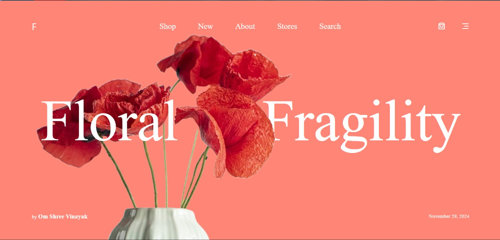

# 🏺Floral Fragility



## Introduction
Welcome to the Floral Fragility a pottery website, an elegant and interactive website showcasing unique pottery designs and high-quality materials. This project demonstrates my skills in frontend development, incorporating advanced animations and responsive design to create an engaging user experience.

## Table of Contents
- [✨ Features](#features)
- [🚀 Demo](#demo)
- [🛠️ Technologies Used](#technologies-used)
- [📦 Installation](#installation)
- [📚 Usage](#usage)
- [🤝 Contributing](#contributing)
- [📜 License](#license)

## ✨ Features
- **Unique Pottery Designs:** 🏺 Displaying handcrafted pottery with a blend of traditional craftsmanship and modern aesthetics.
- **High-Quality Materials:** 🔝 Highlighting the durability and quality of materials used in the pottery.
- **Custom Orders:** 🛠️ Offering custom orders to bring users' visions to life.
- **Smooth Animations:** 🌟 Utilizing GSAP and AOS for interactive and smooth scrolling animations.
- **Responsive Design:** 📱 Ensuring the website looks great on all devices.

## 🚀 Demo
You can view the live demo of the website [here](#).

## 🛠️ Technologies Used
- **Frontend Framework:** React ⚛️
- **Styling:** Tailwind CSS 🎨
- **Animations:** GSAP (GreenSock Animation Platform) and AOS (Animate On Scroll) ✨
- **Scrolling:** Locomotive Scroll 🚂

## 📦 Installation
To get a local copy of the project up and running, follow these steps:

1. **Clone the repository:**
   ```sh
   git clone https://github.com/yourusername/pottery-website.git
   cd pottery-website
